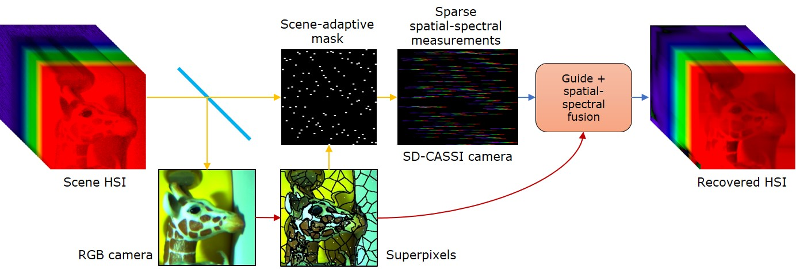
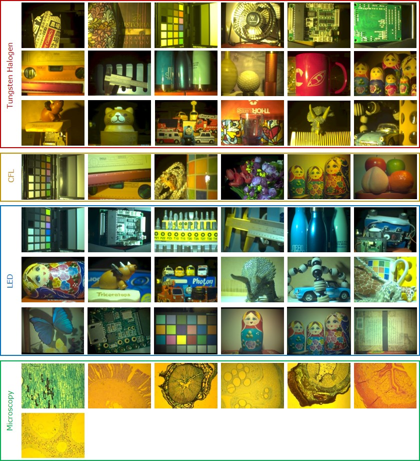

# SASSI
Super-Pixelated Adaptive Spatio-Spectral Imaging



**Video reconstruction**


## Synopsis
Capturing spectral information at every spatial pixel in a scene requires cameras that trade off either spatial, spectral, or temporal resolution.
We observe that images when oversegmented into super-pixels generate homogenous regions that tend to have similar spectra within the super-pixel.
We exploit this observation to build an adaptive hyperspectral camera that consists of an RGB image that acts as a guide and a sptatial-spectral sampler
that allows us to sparsely sample spectra of the scene. We first super-pixelate the scene's RGB image and then sample spectra at least at one location within
each super-pixel. We then fuse the RGB image with the sparse set of spectral profiles to obtain a high spatial and spectral resolution hyperspectral image at video-rate. Our lab prototype was capable of capturing **600x900 spatial images over 68 bands in 400nm - 700nm at 18 frames per second**

## Paper
Download the arXiv version from [here](https://arxiv.org/pdf/2012.14495.pdf)

## Code
We have provided scripts to reconstruct using both our rank-1 approach and learned filter-based approach.

### Requirements
Check `requirements.txt` for installing requirements using `pip`

- Python 3.5 or newer
- Pytorch
- Numpy
- Scipy
- Scikit-image
- Matplotlib
- Cython
- OpenCV
- [fast_slic](https://github.com/Algy/fast-slic)
- Jupyter (to run demo)
### Rank-1 reconstruction
You will need a comopiled version of `cassi_cp.pyx` to use our rank-1 reconstruction technique. We have provided compiled binaries for Windows 10, and Ubuntu 20.04. If you get a segmentation fault or the binary was not loaded successfully, chances are that you need to recompile it using `cython`. We have included a `setup.py` file to simplify the compilation process.

### Learned filter-based approach
*Coming soon*

### Demo
Check `demo.py` to run a simulated example

Download data from [here](https://www.dropbox.com/scl/fo/3e3veejokqtdsu7v81167/h?rlkey=934x7mvnurt41jufrcamjvkmr&dl=0) and place in `path/to/this/folder/data/sample`

The content of the folder should be:

`data/sample`

`|_sample.mat`

`|_display_info.mat`

This sample file is a modified version of a hyperspectral image from the [KAIST dataset](http://vclab.kaist.ac.kr/siggraphasia2017p1/kaistdataset.html)

## High spatial resolution dataset
We collected hyperspectral images of several scenes with our lab prototype including colorful toys, bojects with complex spatial texture, and microscopic images. We used some of the images for training the learned filter-based reconstruction approach.

Download part or all of the hyperspectral images from here: *Coming soon*


## Video sequences
We also collected several video sequences with our lab prototype. You can download the raw data, calibration files, and reconstruction code from here: *coming soon*

## Reference
```
@article{saragadam2020sassi,
  title={SASSI--Super-Pixelated Adaptive Spatio-Spectral Imaging},
  author={Saragadam, Vishwanath and DeZeeuw, Michael and Baraniuk, Richard and Veeraraghavan, Ashok and Sankaranarayanan, Aswin},
  journal={IEEE Intl. Conf. Computational Photography (ICCP), to appear in IEEE Trans. Pattern Analysis and Machine Intelligence},
  year={2021}
}
```
